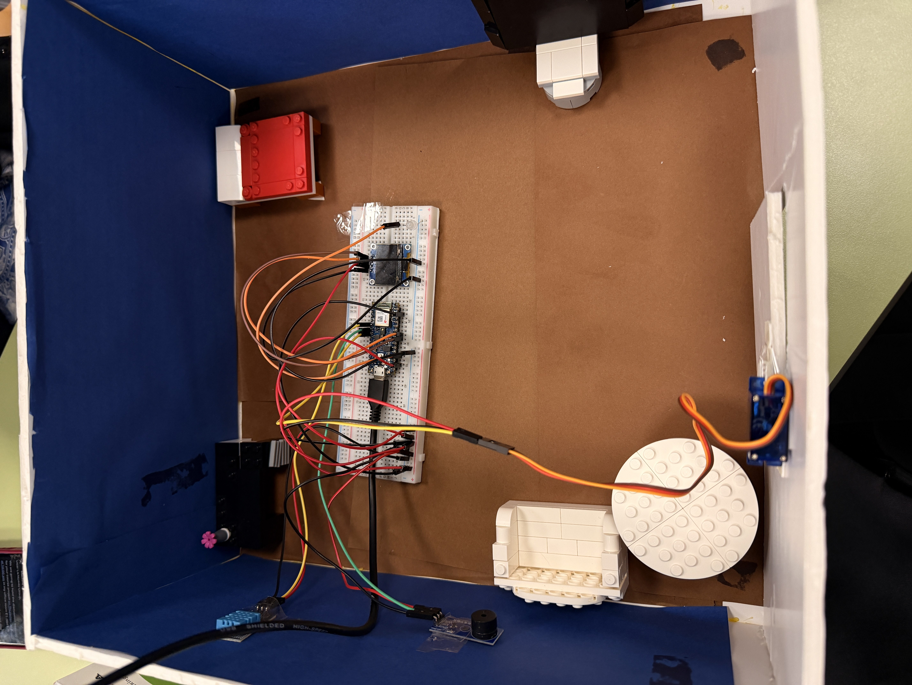
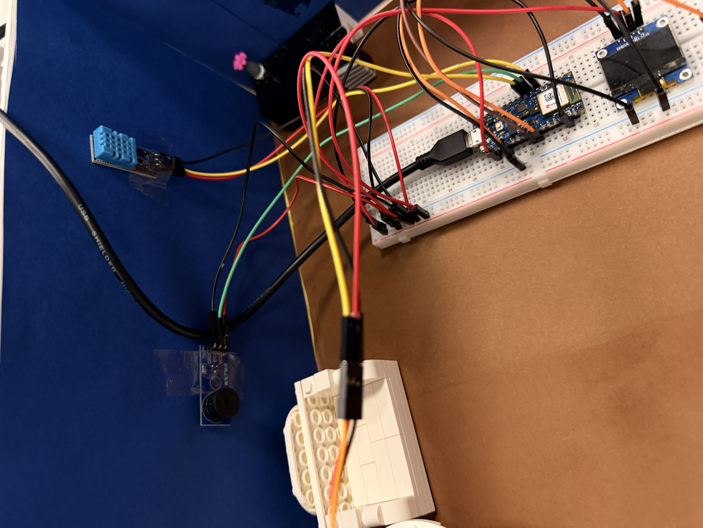

# TinyML Voice Assistant for Smart Room Control

A TinyML-based voice assistant implemented on the Arduino Nano 33 BLE Sense for real-time, on-device keyword recognition and smart-room control.

The system captures spoken commands using the board’s built-in microphone, processes them locally using a trained Edge Impulse model, and triggers hardware actions such as light control, door movement, music playback, and temperature display.

## Project Overview

This project demonstrates a small smart-room prototype controlled through voice commands.

The system was designed to recognize spoken keywords locally on the microcontroller without relying on cloud processing. Once a valid command is detected, the corresponding hardware action is executed and feedback is shown on the OLED display.

## Smart Room Prototype



The prototype represents a miniature smart-room environment built around the Arduino Nano 33 BLE Sense and connected modules.

## Hardware Setup



This image shows the connected embedded hardware used in the project, including the Arduino board, buzzer module, DHT sensor, breadboard wiring, and OLED display.


## Features

- Real-time voice command recognition
- On-device TinyML inference
- Light control using an external LED
- Door control using a servo motor
- Temperature and humidity display
- Music playback using a buzzer
- OLED feedback interface
- Recording indication using the built-in LED
- Background/noise rejection
- Smart-room physical prototype

## Supported Voice Commands

The implemented system supports the following commands:

| Command | Action |
|---|---|
| `light` | Toggles the light ON or OFF |
| `door` | Opens or closes the door using a servo motor |
| `temperature` | Displays temperature and humidity readings |
| `music` | Plays or stops the buzzer melody |
| noise / unknown | Ignored by the system |

## System Workflow

The interaction sequence is:

1. The OLED displays `GET READY`
2. The built-in LED flashes as a recording cue
3. The OLED displays `SPEAK NOW`
4. The microphone records a voice sample
5. The system processes the recorded audio
6. The TinyML model classifies the command
7. The corresponding hardware action is triggered
8. The system returns to listening mode

## Hardware Components

- Arduino Nano 33 BLE Sense
- Built-in microphone
- OLED display
- DHT11 temperature and humidity sensor
- Servo motor
- External LED
- Buzzer
- Breadboard
- Jumper wires
- Smart-room physical model

## Pin Configuration

| Component | Pin |
|---|---|
| DHT11 | D2 |
| Buzzer | D3 |
| External LED | A0 |
| Servo Motor | D4 |
| OLED Display | I2C |
| Recording Indicator | Built-in LED |

## TinyML Model

The keyword-spotting model was developed using Edge Impulse.

Audio was sampled at 16 kHz and converted into MFCC features before being passed into a lightweight convolutional neural network (CNN). The model was optimized for embedded deployment so that inference could run directly on the Arduino Nano 33 BLE Sense.

## Machine Learning Pipeline

The project pipeline includes:

1. Audio data collection
2. Data labeling
3. MFCC feature extraction
4. Data normalization
5. CNN model training
6. Model evaluation
7. Quantization and optimization
8. Deployment to Arduino
9. Real-time inference

## Keyword Detection Logic

During execution, the system records a short audio window and classifies it using the embedded model.

The program selects the label with the highest confidence score and checks it against a threshold before accepting it as a valid command.

If no prediction is confident enough, the system displays a retry message and does not activate any hardware.

## Light Control

The `light` command toggles an external LED.

Saying the command once turns the light on, and saying it again turns it off.

## Door Control

The `door` command controls a servo-based door mechanism.

The servo moves between open and closed positions each time the command is detected.

## Temperature and Humidity Display

The `temperature` command reads data from the DHT11 sensor.

The OLED displays:

- Temperature in degrees Celsius
- Humidity percentage

This view can be toggled on and off using the same command.

## Music Command

The `music` command activates the buzzer and plays a short melody.

The buzzer is used only for this function.

## OLED Interface

The OLED display provides system feedback during operation.

Displayed messages include:

- `Voice System Ready`
- `GET READY`
- `SPEAK NOW`
- `WAIT`
- Detected command results
- Temperature and humidity readings
- Error or retry messages

## Software

The project was implemented in Arduino C++.

Main libraries used:

```cpp
#include <PDM.h>
#include <DHT.h>
#include <Wire.h>
#include <Adafruit_GFX.h>
#include <Adafruit_SSD1306.h>
#include <Servo.h>
